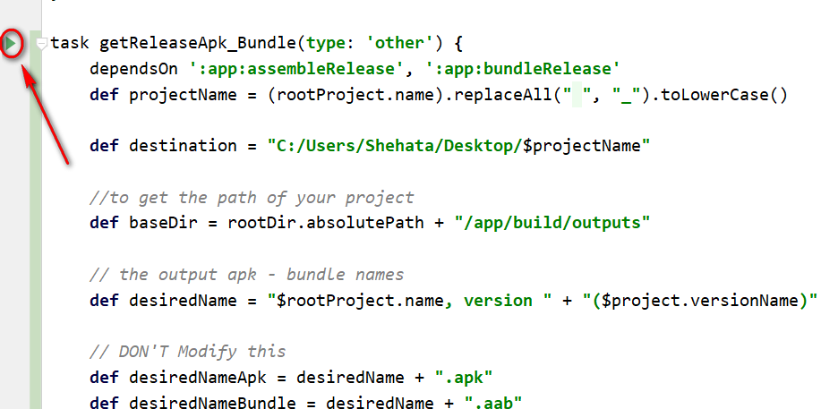
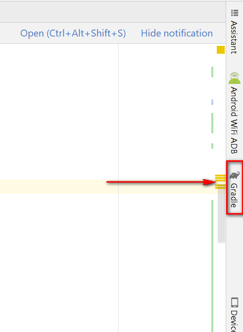
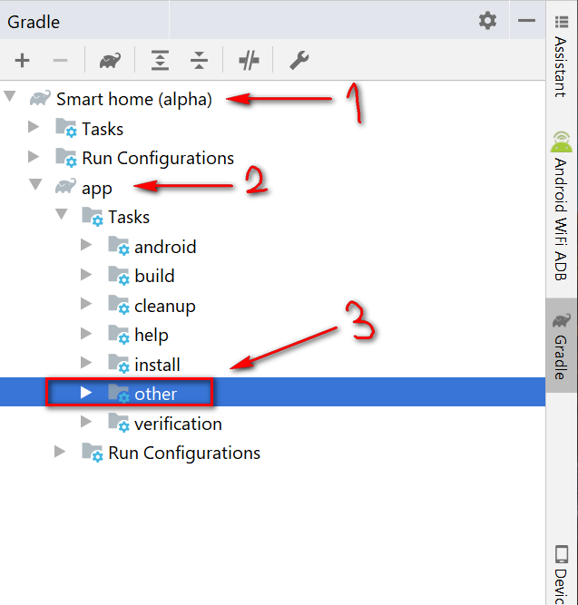
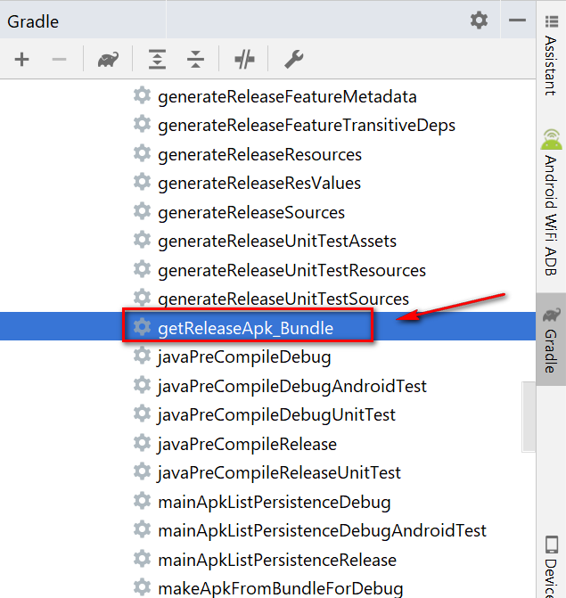
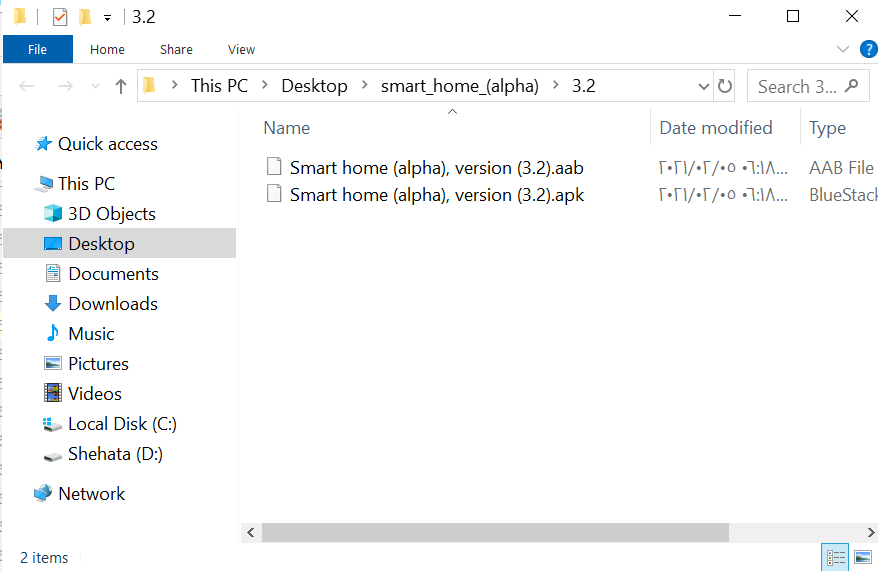

# :rocket: Release Apk and Bundle:
Generate both (Apk &amp; Bundle) with just click from android studio for (Windows &amp; Linux &amp; Mac)

<p align="center">
  
</p>   

# Setup:
1. Add this to your build.gradle (app level).    
``` groovy
project.ext {
    versionCode = 1
    versionName = "1.0"
}
```

2. Modify your versionCode and versionName in the same file (build.gradle (app level)).    
``` groovy
 defaultConfig {
        //...
        versionCode project.versionCode
        versionName project.versionName
        //...
    }
```
3. Add this task to your build.gradle (app level).    

**Note:**   
You need to change the output file -> YOUR_OUTPUT_FILE    
For example : I want to generate my files to the desktop, so I have write     
"C:/Users/Shehata/Desktop/

``` groovy
task getReleaseApk_Bundle() {
    dependsOn ':app:assembleRelease', ':app:bundleRelease'
    def projectName = (rootProject.name).replaceAll(" ", "_").toLowerCase()

    // TODO change YOUR_OUTPUT_FILE 
    def destination = "YOUR_OUTPUT_FILE/$projectName"

    //to get the path of your project
    def baseDir = rootDir.absolutePath + "/app/build/outputs"

    // the output apk - bundle names
    def desiredName = "$rootProject.name, version " + "($project.versionName)"

    // DON'T Modify this
    def desiredNameApk = desiredName + ".apk"
    def desiredNameBundle = desiredName + ".aab"

    def output = file(destination + "/$project.versionName")
    doFirst {
        ext {
            apk = file("$baseDir/apk/release/app-release.apk")
            bundle = file("$baseDir/bundle/release/app-release.aab")
        }
        if (!file(destination).exists()) {
            file(destination).mkdir()
        }
        if (ext.apk.exists() && ext.bundle.exists()) {
            if (!output.exists()) {
                output.mkdir()
            }
            // for coping the apk to destination directory
            copy {
                from ext.apk.absolutePath
                into output
                rename { desiredNameApk }
            }
            // for coping the bundle to destination directory
            copy {
                from ext.bundle.absolutePath
                into output
                rename { desiredNameBundle }
            }
        } else {
            throw new GradleException("Release apk or Bundle not found")
        }
    }
    // Finally trying  to open the output file
    doLast {

        if (System.getProperty('os.name').toLowerCase(Locale.ROOT).contains('windows')) {
            exec {
                commandLine "cmd", "/c", "start $output"
            }
        } else {
            exec {
                commandLine "xdg-open", output
                //commandLine './stop.sh'
            }
        }

        println("Release apk - bundle are Copied successfuly to $output")
    }
}
```
**So your final build.gradle (app level) will be look like this:**
``` groovy
/** 
** Your plugins are placed here
**/

project.ext {
    versionCode = 3
    versionName = "3.2"
}

android {
    compileSdkVersion 29
    buildToolsVersion "29.0.3"

    defaultConfig {
        applicationId "com.ashehata.smarthomealpha"
        minSdkVersion 21
        targetSdkVersion 29
        versionCode project.versionCode
        versionName project.versionName

        testInstrumentationRunner "androidx.test.runner.AndroidJUnitRunner"
    }

    signingConfigs {
    // very important to sign your apk and bundle
        release {
            storeFile file(project.property("MyApp.signing"))
            storePassword project.property("MyApp.signing.password")
            keyAlias project.property("MyApp.signing.alias")
            keyPassword project.property("MyApp.signing.key_password")
        }
    }

    buildTypes {
        release {
            signingConfig signingConfigs.release
            versionNameSuffix ".release"
            minifyEnabled false
            proguardFiles getDefaultProguardFile('proguard-android-optimize.txt'), 'proguard-rules.pro'
        }
    }

}

dependencies {
  /** 
** Your dependencies are placed here
**/
}

task getReleaseApk_Bundle(type: 'other') {
    dependsOn ':app:assembleRelease', ':app:bundleRelease'
    def projectName = (rootProject.name).replaceAll(" ", "_").toLowerCase()

    def destination = "C:/Users/Shehata/Desktop/$projectName"

    //to get the path of your project
    def baseDir = rootDir.absolutePath + "/app/build/outputs"

    // the output apk - bundle names
    def desiredName = "$rootProject.name, version " + "($project.versionName)"

    // DON'T Modify this
    def desiredNameApk = desiredName + ".apk"
    def desiredNameBundle = desiredName + ".aab"

    def output = file(destination + "/$project.versionName")
    doFirst {
        ext {
            apk = file("$baseDir/apk/release/app-release.apk")
            bundle = file("$baseDir/bundle/release/app-release.aab")
        }
        if (!file(destination).exists()) {
            file(destination).mkdir()
        }
        if (ext.apk.exists() && ext.bundle.exists()) {
            if (!output.exists()) {
                output.mkdir()
            }
            // for coping the apk to destination directory
            copy {
                from ext.apk.absolutePath
                into output
                rename { desiredNameApk }
            }
            // for coping the bundle to destination directory
            copy {
                from ext.bundle.absolutePath
                into output
                rename { desiredNameBundle }
            }
        } else {
            throw new GradleException("Release apk or Bundle not found")
        }
    }
    // Finally trying  to open the output file
    doLast {

        if (System.getProperty('os.name').toLowerCase(Locale.ROOT).contains('windows')) {
            exec {
                commandLine "cmd", "/c", "start $output"
            }
        } else {
            exec {
                commandLine "xdg-open", output
                //commandLine './stop.sh'
            }
        }

        println("Release apk - bundle are Copied successfuly to $output")
    }
}
```
**Important**   
Your gradle.properties file should contains this signing config
``` groovy
MyApp.signing=YOUR_KEYSTORE_LOCATION
MyApp.signing.password=ALIAS_PASS
MyApp.signing.key_password=KEYSTORE_PASS
MyApp.signing.alias=ALIAS_NAME
```  
change ->  YOUR_KEYSTORE_LOCATION, ALIAS_PASS, KEYSTORE_PASS, ALIAS_NAME    

--- 

4. Run your task:   
way number 1 (Easy way):   
- **Press** this play icon to start the task like this..
<p align="center">
  
</p>  

OR     

way number 2 (Difficult way):   
A. Click on gradle tab
<p align="center">
  
</p>  

B.
<p align="center">
  
</p>  
<p align="center">
  
</p> 

--- 

5. Finally the file exploler will be opend for your output file    
<p align="center">
  
</p>  
